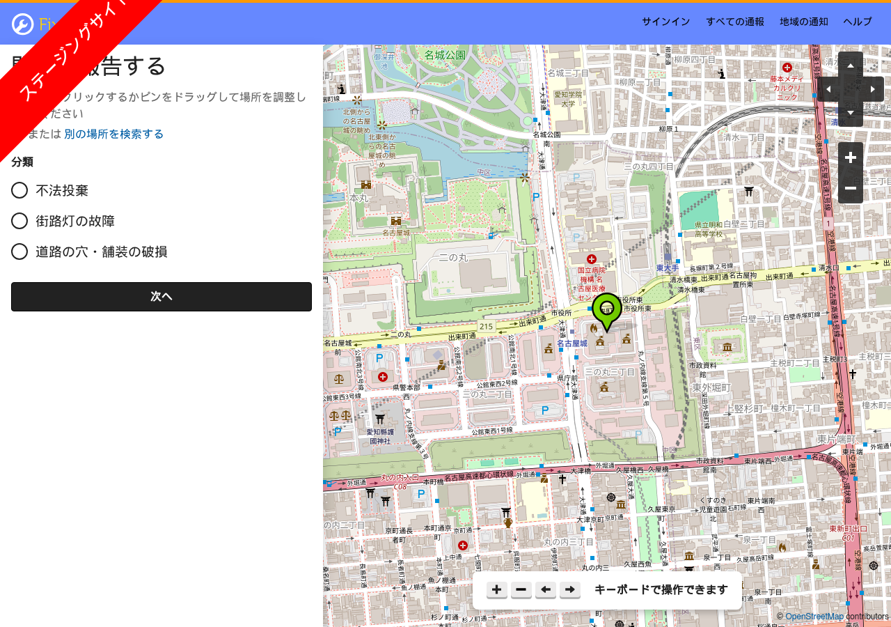

# fixmystreet-jp

[FixMyStreet](https://github.com/mysociety/fixmystreet)（英国 mySociety が開発する、道路の穴・不法投棄・街灯の故障などを地図から自治体に通報し、対応状況を公開するオープンソース。AGPL-3.0）を **日本語で使うための非公式リポジトリ** です。

- `locale/ja_JP.UTF-8/LC_MESSAGES/FixMyStreet.po` — 本家の `FixMyStreet.po`（1,456 文字列）の日本語訳。プレースホルダ（`%s` `%d` `%%`・HTMLタグ・実体参照・URL・改行）は原文と同一であることを機械検証済み
- `conf/general.yml-jp` — Docker 版の設定例（`LANGUAGES` に `ja,Japanese,ja_JP` を追加、`MAPIT_URL` を MapIt Global（OpenStreetMap の行政境界。日本は O07=市区町村・O08=区）に、`BASE_URL` をローカル検証用に）
- `docker-compose.override.yml` — 公式 `docker-compose.yml` にポートと日本語ロケールのマウントを足したもの
- `scripts/translate_po_gemma.py` — 未訳エントリをローカルLLM（gemma4）で訳し、プレースホルダ不一致を不採用にする翻訳スクリプト

本家への翻訳提案は mySociety の方針どおり Transifex 経由が正式ルートです。あわせて本家へ Pull Request を出しています（`docs/upstream_pr.txt` にURL）。本家に取り込まれた分は本家の翻訳が正となり、本リポジトリは差分の保守にとどめます。

**本リポジトリは mySociety および FixMyStreet プロジェクトとは無関係の非公式なものです。**

## 使い方（Docker・公式 stable イメージ）

```bash
git clone https://github.com/katsushi2441/fixmystreet-jp.git
cd fixmystreet-jp
# conf/general.yml-jp の BASE_URL・メール設定を自分の値にしてから
docker compose up -d
# 初回だけ: コンテナ内で日本語ロケールを生成し .mo を作る
docker compose exec fixmystreet bash -lc 'echo "ja_JP.UTF-8 UTF-8" >> /etc/locale.gen && locale-gen ja_JP.UTF-8 && cd /var/www/fixmystreet/fixmystreet && commonlib/bin/gettext-makemo && systemctl restart fixmystreet'
```

`http://<ホスト>:18382/` で日本語の FixMyStreet が開きます（ポートは `docker-compose.override.yml` で変更できます）。

地域の判定は MapIt Global（`https://global.mapit.mysociety.org/`）で日本の市区町村・区が引けます（名古屋市＝area 989637、中区＝871979 のように OSM の行政境界）。対応機関（body）と分類（category）は管理画面 `/admin`（`bin/createsuperuser` で管理者を作成）から登録します。管理画面のログインを自動化しづらい場合は、DB に直接入れる SQL の例を `docs/nagoya-body.sql` に置いています。



## 導入キット

手順書・落とし穴・設定・SQL・AI指示書を1つにした導入キット（5,500円税込）: https://kappstore.exbridge.jp/app.php?id=b34e36cfaad27a14

## 解説記事

- 導入と日本語化の実録: https://katsushi2441.github.io/vwork/articles/2026-09-07-fixmystreet-japanese-guide.html

## ライセンス

翻訳・スクリプトは FixMyStreet 本体と同じ AGPL-3.0 で提供します。翻訳の著作権は株式会社エクスブリッジ（小嶋 篤）に帰属し、本家プロジェクトへの取り込みを妨げません。
